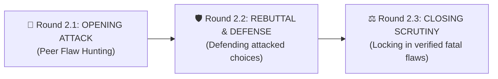
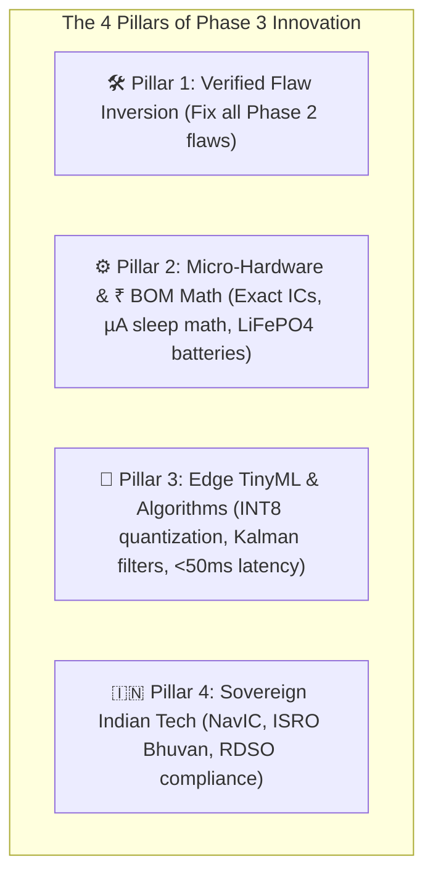
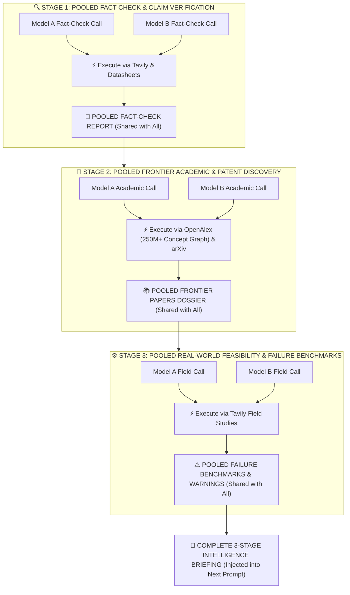
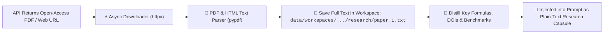

# 🏛️ AI Consensus Arena: Super-Architecture & Deliberation Engine Specification
> **Next-Generation Multi-Agent AI Deliberation, Autonomous 3-Stage Pooled Research, & Sovereign SIH Blueprint Engine**
> *Document Version: 3.0.0-PROD | Status: LOCKED ARCHITECTURAL SPECIFICATION*

---

## 📑 Table of Contents
1. [Executive Summary & Core Philosophy](#1-executive-summary--core-philosophy)
2. [Master End-to-End System Architecture (The Mega-Diagram)](#2-master-end-to-end-system-architecture-the-mega-diagram)
3. [Phase 1: Multi-Persona Genesis (Internal 4-Pass Foundation)](#3-phase-1-multi-persona-genesis-internal-4-pass-foundation)
4. [Phase 2: The Adversarial Crucible (3-Round Courtroom Debate)](#4-phase-2-the-adversarial-crucible-3-round-courtroom-debate)
5. [Phase 3: The 10x Advanced Solution Engine (2-Round Progressive Polish)](#5-phase-3-the-10x-advanced-solution-engine-2-round-progressive-polish)
6. [Phase 4: The Convergence Crucible & Sovereign Master Blueprint](#6-phase-4-the-convergence-crucible--sovereign-master-blueprint)
7. [The Standardized 3-Stage Pooled Research Engine (Always-On Hive-Mind)](#7-the-standardized-3-stage-pooled-research-engine-always-on-hive-mind)
8. [PDF Download, Ingestion & Plain-Text Distillation Pipeline](#8-pdf-download-ingestion--plain-text-distillation-pipeline)
9. [JSON Schemas, Contracts & The `<deliberation_scratchpad>`](#9-json-schemas-contracts--the-deliberation_scratchpad)

---

## 1. Executive Summary & Core Philosophy

The **AI Consensus Arena (Super-Architecture)** elevates multi-model artificial intelligence from simple conversational chatbots into an **autonomous, scientifically-grounded, multi-round engineering gauntlet**. 

Instead of producing generic, safe, middle-of-the-road answers, the system enforces four foundational engineering principles:

1. **Eliminate Uniform Prompting**: Every model undergoes a rigorous **4-pass internal persona evolution** (*Architect → Red-Team Critic → Field/BOM Engineer → Security Officer*) before entering the debate arena.
2. **Eliminate Sycophancy & Premature Convergence**: Phase 2 uses a **3-round adversarial debate cycle** (*Opening Attack → Rebuttal/Defense → Closing Flaw Scrutiny*) to expose and lock in real architectural vulnerabilities.
3. **Overcome the "Unknown Unknowns"**: Rather than relying only on what the AI already knows, an **Autonomous 3-Stage Pooled Research Scout** crawls OpenAlex's 250M+ concept graph, arXiv preprints, and Tavily live web sources to discover cutting-edge science, novel materials, and SOTA algorithms between rounds.
4. **Collective Shared Intelligence Pool**: In each research stage, every AI model independently issues research queries; the engine executes them in parallel, compiles a **Unified Research Dossier**, and broadcasts all findings to every model.

---

## 2. Master End-to-End System Architecture (The Mega-Diagram)

```mermaid
flowchart TD
    %% Styling
    classDef inputStyle fill:#0f172a,stroke:#38bdf8,stroke-width:3px,color:#f8fafc;
    classDef p1Style fill:#1e1b4b,stroke:#6366f1,stroke-width:2px,color:#f8fafc;
    classDef p2Style fill:#4c0519,stroke:#f43f5e,stroke-width:2px,color:#f8fafc;
    classDef p3Style fill:#064e3b,stroke:#10b981,stroke-width:2px,color:#f8fafc;
    classDef p4Style fill:#3b0764,stroke:#c084fc,stroke-width:2px,color:#f8fafc;
    classDef researchStyle fill:#1e293b,stroke:#fbbf24,stroke-width:2px,color:#fbbf24;
    classDef verdictStyle fill:#18181b,stroke:#f59e0b,stroke-width:3px,color:#fde68a;

    %% 0. START
    Start(["🚀 USER INPUT: SIH Problem Statement & Domain Constraints"]):::inputStyle
    Start --> R_Init

    %% INITIAL RESEARCH SCAN
    subgraph R_BLOCK_0 ["🔬 PRE-DEBATE: INITIAL DOMAIN DISCOVERY"]
        R_Init["🤖 Autonomous Domain Scan<br>• OpenAlex: SOTA papers & patent concepts<br>• Tavily: Government standards & baseline solutions"]
        --> R_Init_Dossier["📄 Base Grounding Dossier (Injected into Phase 1)"]
    end
    class R_BLOCK_0,R_Init,R_Init_Dossier researchStyle;

    R_Init_Dossier --> P1_Entry

    %% ==========================================================
    %% PHASE 1: MULTI-PERSONA GENESIS
    %% ==========================================================
    subgraph PHASE1 ["🏛️ PHASE 1: Multi-Persona Genesis (Internal 4-Pass Foundation)"]
        direction TB
        P1_Entry["For each Participating AI Model independently:"]
        
        P1_1["Pass 1.1: 🏛️ ARCHITECT GENESIS<br>• Unconstrained 100x theoretical maximum vision<br>• End-to-end system decomposition & data workflows"]
        P1_2["Pass 1.2: 😈 MURPHY'S LAW INVERSION<br>• Ruthless self-attack on Pass 1.1<br>• Expose hidden race conditions, bottlenecks & single points of failure"]
        P1_3["Pass 1.3: ⚙️ FRUGAL FIELD & BOM REALITY<br>• Ground in 45°C Indian summer, dust, battery discharge curves<br>• Realistic Bill of Materials (BOM) itemized in Indian Rupees (₹)"]
        P1_4["Pass 1.4: 🛡️ FORT KNOX SECURITY & COMPLIANCE<br>• Physical tampering protection & offline fallback<br>• NDMA, ISRO/Bhuvan, RDSO statutory compliance"]
        
        P1_Dossier["📄 BATTLE-TESTED MODEL DOSSIER (4 Layers Complete)"]

        P1_Entry --> P1_1 --> P1_2 --> P1_3 --> P1_4 --> P1_Dossier
    end
    class PHASE1,P1_Entry,P1_1,P1_2,P1_3,P1_4,P1_Dossier p1Style;

    P1_Dossier --> R_BLOCK_1

    %% RESEARCH BLOCK 1
    subgraph R_BLOCK_1 ["🔬 RESEARCH BLOCK 1: POOLED PEER FACT-CHECK & FRONTIER PAPERS"]
        direction TB
        R1_Calls["All Models submit Research Calls based on Phase 1"]
        --> R1_Exec["⚡ Parallel Execution: Tavily (Fact-Check) + OpenAlex/arXiv (Papers)"]
        --> R1_Dossier["📑 POOLED RESEARCH INTELLIGENCE BRIEF #1<br><i>(Shared with ALL Models simultaneously)</i>"]
    end
    class R_BLOCK_1,R1_Calls,R1_Exec,R1_Dossier researchStyle;

    R1_Dossier --> P2_Entry

    %% ==========================================================
    %% PHASE 2: ADVERSARIAL CRUCIBLE
    %% ==========================================================
    subgraph PHASE2 ["⚔️ PHASE 2: The Adversarial Crucible (3-Round Cross-Debate)"]
        direction TB
        P2_Entry["All AI Models enter the Public Arena"]

        P2_R1["🥊 Round 2.1: OPENING CROSS-EXAMINATION<br>• Peer-to-peer flaw hunting on Phase 1 dossiers<br>• Zero politeness: Attack bandwidth limits, naive cost, power traps"]
        
        P2_R2["🛡️ Round 2.2: DEFENSE, REBUTTAL & COUNTER-ATTACK<br>• Defend attacked architectures with technical calculations<br>• Counter-expose flaws in peer critics' assumptions"]
        
        P2_R3["⚖️ Round 2.3: FINAL CLOSING CRITIQUE<br>• Jury-grade test: Which defenses held up vs. failed?<br>• Lock in the definitive list of <b>Verified Fatal Vulnerabilities</b>"]

        P2_Entry --> P2_R1 --> P2_R2 --> P2_R3
    end
    class PHASE2,P2_Entry,P2_R1,P2_R2,P2_R3 p2Style;

    P2_R3 --> R_BLOCK_2

    %% RESEARCH BLOCK 2
    subgraph R_BLOCK_2 ["🔬 RESEARCH BLOCK 2: POOLED HARDWARE IC & SOTA ALGORITHM SCAN"]
        direction TB
        R2_Calls["All Models submit Calls to solve Phase 2 Verified Flaws"]
        --> R2_Exec["⚡ Parallel Execution: Indian Market ICs (₹) + TinyML & SOTA Papers"]
        --> R2_Dossier["📑 POOLED RESEARCH INTELLIGENCE BRIEF #2<br><i>(Shared with ALL Models simultaneously)</i>"]
    end
    class R_BLOCK_2,R2_Calls,R2_Exec,R2_Dossier researchStyle;

    R2_Dossier --> P3_Entry

    %% ==========================================================
    %% PHASE 3: 10x ADVANCED SOLUTIONS
    %% ==========================================================
    subgraph PHASE3 ["🚀 PHASE 3: The 10x Advanced Solution Engine (2 Rounds)"]
        direction TB
        P3_Entry["Input: Verified Fatal Vulnerabilities + Intelligence Brief #2"]

        P3_R1["🛠️ Round 3.1: THE 10x QUANTUM LEAP<br>• <b>Flaw Inversion:</b> Direct mathematical fixes for all Phase 2 flaws<br>• <b>Micro-Hardware:</b> Exact ICs, µA sleep math, LiFePO4 batteries, ₹ BOM<br>• <b>Edge TinyML:</b> INT8 quantized models, FFT/Kalman filters, sub-50ms latency<br>• <b>Sovereign Tech:</b> NavIC positioning, ISRO/Bhuvan, RDSO compliance"]

        P3_R2["🔬 Round 3.2: MICRO-OPTIMIZATION CROSS-POLLINATION<br>• Peer review of 10x breakthroughs<br>• Inject minute neglected details: Brownout flash write protection,<br>sensor auto-calibration, hardware interrupt triggers"]

        P3_Entry --> P3_R1 --> P3_R2
    end
    class PHASE3,P3_Entry,P3_R1,P3_R2 p3Style;

    P3_R2 --> R_BLOCK_3

    %% RESEARCH BLOCK 3
    subgraph R_BLOCK_3 ["🔬 RESEARCH BLOCK 3: FINAL COMPLIANCE & CITATION AUDIT"]
        direction TB
        R3_Calls["All Models submit Final Standards & Benchmark Verification Calls"]
        --> R3_Exec["⚡ Parallel Execution: ISRO/RDSO Specs + Citation DOIs"]
        --> R3_Dossier["📑 POOLED RESEARCH INTELLIGENCE BRIEF #3<br><i>(Shared with ALL Models simultaneously)</i>"]
    end
    class R_BLOCK_3,R3_Calls,R3_Exec,R3_Dossier researchStyle;

    R3_Dossier --> P4_Entry

    %% ==========================================================
    %% PHASE 4: CONVERGENCE CRUCIBLE
    %% ==========================================================
    subgraph PHASE4 ["👑 PHASE 4: The Convergence Crucible & Sovereign Master Blueprint"]
        direction TB
        P4_Entry["Assemble Phase 3 Optimized Innovations + Final Brief"]

        P4_R1["🤝 Round 4.1: CONCESSION TREATY & HYBRID ASSEMBLY<br>• Mandatory peer concessions: Adopting superior peer components<br>• Merge into a unified, non-conflicting master architecture<br>• Official Model Consensus Vote (AGREE / DISAGREE / % Alignment)"]

        P4_Check{"Master Arbiter Consensus Check<br>• Agreement ≥ 90%?<br>• Zero fatal friction points?"}

        P4_Duel["⚡ Round 4.2: TARGETED DISPUTE DUEL<br><i>Arbiter isolates exact remaining conflict point<br>and forces rapid mathematical resolution</i>"]

        P4_Verdict["🏆 GRAND FINALE: SOVEREIGN SIH MASTER DELIVERABLE<br>1. Executive 1-Minute Pitch & Core Innovation Hook<br>2. Complete System Architecture & Data Signal Flow<br>3. Itemized Hardware BOM Table in Indian Rupees (₹)<br>4. Edge TinyML Pipeline & Inference Specs<br>5. Industrial Chaos & Power-Loss Recovery Protocols<br>6. Indian Ministry Standards Compliance (RDSO/NDMA/ISRO)<br>7. Official 100% Multi-Model Consensus Ratification Certificate"]

        P4_Entry --> P4_R1 --> P4_Check
        P4_Check -- "Dispute Remains" --> P4_Duel --> P4_Check
        P4_Check -- "Consensus Reached!" --> P4_Verdict
    end
    class PHASE4,P4_Entry,P4_R1,P4_Check,P4_Duel,P4_Verdict p4Style;

    %% 5. OUTPUT
    P4_Verdict --> FinalOutput(["📦 EXPORT DELIVERABLES:<br>• LATEST_CONSENSUS_VERDICT.md<br>• Interactive HTML Report<br>• Verified Citations & DOIs Table<br>• Downloaded Plain-Text Research Papers"]):::verdictStyle
```



---

## 3. Phase 1: Multi-Persona Genesis (Internal 4-Pass Foundation)

In Phase 1, no model interacts with other models. Each model independently executes 4 sequential, self-refining passes:

```
Pass 1.1 (Lead Architect) ──► Pass 1.2 (Self-Assassination) ──► Pass 1.3 (Frugal BOM Reality) ──► Pass 1.4 (Security & Compliance)
```

| Pass | Persona Name | Cognitive Mission & Focus |
| :---: | :--- | :--- |
| **1.1** | **`ARCHITECT_GENESIS`** | High-level system vision, theoretical maximum performance, clean component separation, data ingestion pipelines. |
| **1.2** | **`MURPHYS_LAW_INVERSION`** | Ruthless self-attack on Pass 1.1. Spot hidden race conditions, single points of failure, unfeasible bandwidth assumptions. |
| **1.3** | **`FRUGAL_FIELD_REALITY`** | Re-engineer for Indian terrain: 45°C ambient heat, dust, intermittent cellular connectivity, non-technical rural operators, itemized ₹ BOM. |
| **1.4** | **`FORT_KNOX_LOCKDOWN`** | Physical tamper-resistance, offline FIFO ring-buffers, compliance with Indian statutory norms (ISRO Bhuvan, RDSO, NDMA). |

---

## 4. Phase 2: The Adversarial Crucible (3-Round Courtroom Debate)

Phase 2 is a structured 3-round courtroom debate that exposes and validates true architectural vulnerabilities:



* **Round 2.1 (Opening Attack)**: Models receive all peer Phase 1 dossiers. Models attack specific peer flaws in bandwidth, power math, and cost underestimations with zero politeness.
* **Round 2.2 (Defense & Rebuttal)**: Models defend against attacks with technical proofs, calculations, or counter-expose flawed assumptions in peer critiques.
* **Round 2.3 (Closing Flaw Scrutiny)**: Final evaluation determining which defenses held up and which failed, producing a locked list of **Verified Fatal Vulnerabilities**.

---

## 5. Phase 3: The 10x Advanced Solution Engine (2-Round Progressive Polish)

In Phase 3, models switch from finding flaws to **engineering superior solutions across 4 Pillars**:



* **Round 3.1 (`THE_10X_QUANTUM_LEAP`)**: Every AI submits its advanced, hardened solution covering all 4 pillars.
* **Round 3.2 (`MICRO_OPTIMIZATION_CROSS_POLLINATION`)**: Models review peer breakthroughs and inject minute neglected details (brownout flash write protection, sensor auto-calibration, hardware interrupt triggers).

---

## 6. Phase 4: The Convergence Crucible & Sovereign Master Blueprint

Phase 4 drives models toward genuine, earned consensus and generates the pitch-winning deliverable:

* **Round 4.1 (Concession Treaty & Hybrid Assembly)**: Models formally concede superior peer components, assemble the unified hybrid architecture, and cast their official Consensus Vote.
* **Arbiter Jury Check**: If agreement ≥ 90% and zero fatal friction points remain → Proceed to Grand Finale. If a dispute remains → Arbiter triggers **Round 4.2: Targeted Dispute Duel** to resolve the exact conflict.
* **Grand Finale Verdict Structure**:
  1. `# 🏆 SIH Master Consensus Deliverable: [Title]`
  2. `## 1. Executive Summary & 1-Minute Innovation Hook`
  3. `## 2. End-to-End System Architecture & Data Flow`
  4. `## 3. Itemized Hardware Bill of Materials (BOM) in Indian Rupees (₹)`
  5. `## 4. Edge TinyML & Anomaly Detection Pipeline`
  6. `## 5. Industrial Chaos & Power-Loss Recovery Protocols`
  7. `## 6. Indian Ministry Standards Compliance (RDSO/NDMA/ISRO)`
  8. `## 7. Official Multi-Model Consensus Ratification Sign-Off`

---

## 7. The Standardized 3-Stage Pooled Research Engine (Always-On Hive-Mind)

The Research Engine runs between rounds as a **3-Stage Pooled Intelligence Loop**:



---

## 8. PDF Download, Ingestion & Plain-Text Distillation Pipeline



* **Open-Access PDFs (arXiv / OpenAlex OA)**: Downloaded in background, stripped of formatting noise, full text saved to disk, key math/benchmarks distilled for prompts.
* **Paywalled Works**: OpenAlex provides the full structured abstract and citation metrics directly in JSON, ensuring zero failures.
* **Web Sources (Tavily)**: Pre-cleaned text and markdown returned directly.

---

## 9. JSON Schemas, Contracts & The `<deliberation_scratchpad>`

Every debater model response adheres to this unified schema, using a free-form reasoning scratchpad before formatting JSON:

```json
{
  "deliberation_scratchpad": "Unconstrained step-by-step internal reasoning, critique of peer math, and edge-case exploration...",
  
  "architect_lens": "System structure, data pipelines, and workflow.",
  "critic_lens": "Identified edge cases, failure modes, and fragile assumptions.",
  "field_hardware_lens": "Hardware ICs, power calculations, and ₹ BOM unit economics.",
  "security_compliance_lens": "Tamper-proofing, fault tolerance, and Indian standards compliance.",
  
  "critiques": [
    {
      "target_model_id": "m_peer_id",
      "target_model_name": "Peer Model Name",
      "flaw_identified": "Specific vulnerability or false assumption",
      "counter_argument": "Rigorous technical counter-argument with citation"
    }
  ],
  
  "concessions_and_defenses": [
    {
      "conceded_point": "Point conceded to peer",
      "conceded_to": "Peer Model Name",
      "adaptation": "How solution was updated or defended"
    }
  ],
  
  "refined_solution": "Complete, hardened conceptual solution.",
  
  "autonomous_research_calls": [
    {
      "stage": "fact_check | frontier_academic | field_feasibility",
      "target_engine": "openalex_arxiv | tavily_web",
      "query_purpose": "Why this search is needed",
      "search_query": "Specific targeted search string"
    }
  ],
  
  "consensus_vote": "AGREE | DISAGREE | NEEDS_REFINEMENT",
  "agreement_percentage": 85
}
```

---

*(End of Master Architecture Specification)*
