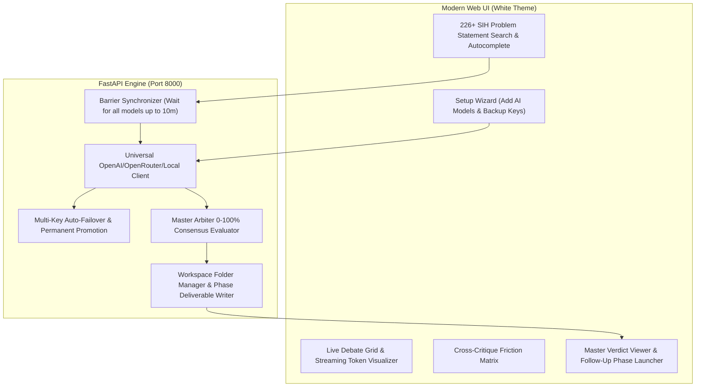

# 🏛️ AI Consensus Arena: Multi-LLM Collaborative Debate & Deliverables Engine
> **Autonomous Multi-Model Deliberation, Multi-Key Failover, Dedicated Workspaces & Consensus Synthesis for Smart India Hackathon (SIH)**

[](https://www.python.org/)
[](https://fastapi.tiangolo.com/)
[](https://opensource.org/licenses/MIT)

---

## 📖 Table of Contents
1. [Overview & Vision](#-overview--vision)
2. [⚡ 60-Second Quickstart (Humans)](#-60-second-quickstart-humans)
3. [🤖 For AI Coding Agents & LLM Assistants](#-for-ai-coding-agents--llm-assistants)
4. [🌟 Core Architecture & Key Features](#-core-architecture--key-features)
5. [🔄 Multi-Key Auto-Failover & Permanent User Storage](#-multi-key-auto-failover--permanent-user-storage)
6. [📋 226+ Stored SIH Problem Statements](#-226-stored-sih-problem-statements)
7. [📂 Workspace Folders & Follow-Up Multi-Phase Loop](#-workspace-folders--follow-up-multi-phase-loop)
8. [🧠 The 4 Cognitive Lenses (No-Code Constraint)](#-the-4-cognitive-lenses-no-code-constraint)
9. [📡 REST & SSE API Reference](#-rest--sse-api-reference)
10. [🛠️ Troubleshooting](#-troubleshooting)

---

## 🎯 Overview & Vision

The **AI Consensus Arena** is an orchestrator designed to solve complex real-world engineering challenges (specifically tailored for **Smart India Hackathon**). 

Instead of asking a single AI model for an answer, this platform pits multiple leading LLMs (e.g., **Claude 3.5 Sonnet, DeepSeek R1, Gemini 2.0 Flash, OpenAI o3-mini, Llama 3.3, local Ollama**) against each other in structured, multi-round debates. 

Every AI simultaneously stress-tests solutions across **4 distinct cognitive personas**, challenges peer flaws in a live **Cross-Critique Friction Matrix**, and iterates across infinite rounds until a **100% Unanimous Master Consensus Verdict** is achieved.

---

## ⚡ 60-Second Quickstart (Humans)

### 1. Prerequisites
- **Python 3.10+** installed on Windows, macOS, or Linux.
- **No Node.js or npm required**: The web dashboard is self-contained and served directly by FastAPI.

### 2. Clone & Install Dependencies
```bash
# Clone the repository
git clone https://github.com/techyhafiz/SIH_AI_AGENT_DEBATE.git
cd SIH_AI_AGENT_DEBATE/multi-ai-debate/backend

# Install Python requirements
pip install -r requirements.txt
```

### 3. Launch the Application
```bash
python run.py
```

### 4. Open Dashboard
Open your browser and navigate to:
👉 **`http://localhost:8000/`**

1. **Setup Wizard**: Enter your AI model endpoints and API keys (plus backup keys).
2. **Select SIH Problem Statement**: Search by PS Code (e.g. `SIH26001`) or keywords (e.g. `Landslide`, `Railway`, `Agriculture`).
3. **Add Custom Constraints**: Optionally provide custom latency, cost, or hardware constraints.
4. **Launch Debate**: Watch real-time streaming tokens, persona analysis, friction matrices, and final `.md` synthesis!

---

## 🔑 Supported API Key Sources & Where to Register

To power your multi-AI debate arena, obtain keys from any of the verified providers below:

| # | Provider Gateway | Base URL Endpoint | Recommended AI Models | Key Registration Link |
| :---: | :--- | :--- | :--- | :---: |
| **1** | **AgentRouter** | `https://agentrouter.org/v1` | Claude Opus 4.8 / 5.0, GPT 5.6 Sol | [👉 Register on AgentRouter](https://agentrouter.org/register?aff=cHl5) |
| **2** | **Google Gemini (AI Studio)** | `https://generativelanguage.googleapis.com/v1beta/openai` | Gemini 3.7 Flash Pool, 3.5 Flash Lite | [👉 Get Gemini Key](https://aistudio.google.com/) |
| **3** | **OpenRouter** | `https://openrouter.ai/api/v1` | GLM 5.2 (Free), Nemotron 120B Super, Stealth Ox-Alpha | [👉 Get OpenRouter Key](https://openrouter.ai/keys) |
| **4** | **TokenRouter** | `https://api.tokenrouter.com/v1` | Qwen 3.8 Max (Free Deep Reasoning) | [👉 Get TokenRouter Key](https://tokenrouter.com/) |
| **5** | **BluesMinds** | `https://api.bluesminds.com/v1` | Claude Sonnet 5 Unlimited, Llama 3.3 | [👉 Get BluesMinds Key](https://bluesminds.com/) |

---

## 🤖 For AI Coding Agents & LLM Assistants

If you are an AI assistant (Antigravity, Cursor, Claude Code, GitHub Copilot, Roo Code, Windsurf) helping a human user set up, run, or extend this application:

👉 **Read [`AGENTS_GUIDE.md`](./AGENTS_GUIDE.md)** for detailed technical contracts, JSON schemas, background execution protocols, and endpoint automation.

> ⚡ **DIRECT KEY POPULATION IN CHAT**:  
> When the user pastes an API key or base URL into the conversation, AI Agents must **directly update `multi-ai-debate/backend/data/user_config.json`** and probe latency via `POST /api/models/test` instead of asking the user to manually edit JSON files!

### Quick Commands for Agents:
```bash
# 1. Start backend server synchronously or as background daemon
python multi-ai-debate/backend/run.py

# 2. Run backend validation suite
python multi-ai-debate/backend/test_e2e_simulation.py

# 3. Probe model endpoint
POST /api/models/test {"base_url": "...", "api_key": "...", "model_id": "..."}

# 4. Fetch stored problem statements
GET /api/problem-statements?query=SIH26001
```

---

## 🌟 Core Architecture & Key Features



1. **Independent Per-AI Endpoints**: Each participating model can have its own Base URL, Model ID, Primary Key, and Backup Keys.
2. **Barrier Synchronization**: Accommodates high latency and deep-thinking reasoning models (DeepSeek R1, o1/o3). The round only advances when all active models complete their turn.
3. **10-Minute Timeout Watchdog & Quarantine**: If a model hangs or exhausts all backup keys, it is quarantined without crashing the debate, showing an interactive alert to the user.
4. **Strict No-Code Constraint**: Models focus 100% on system architecture, protocol design, edge cases, failure modes, and hardware BOM rather than trivial code.

---

## 🔄 Multi-Key Auto-Failover & Permanent User Storage

### How Key Failover Works:
When calling an LLM provider:
1. The engine attempts inference using the **Primary API Key**.
2. If the API returns `401 Unauthorized`, `403 Forbidden`, `429 Rate Limit`, or quota exhaustion:
   - The engine automatically catches the error and retries with **Backup Key #1**, then **Backup Key #2**, etc.
3. Once a backup key succeeds, the engine **promotes the backup key to primary**.
4. The promoted key is saved permanently to `multi-ai-debate/backend/data/user_config.json` so all future rounds and sessions inherit the working key.

---

## 📋 226+ Stored SIH Problem Statements

The platform includes all 226 official Smart India Hackathon problem statements stored in `data/extracted_problem_statements.json`:
- **Instant Search**: Type `SIH26001` or keywords like `Landslide`, `Dementia`, `Railway`, `Drone`.
- **Auto-Fill**: Automatically fills Title, Ministry/Organization, Background, and Expected Solution.
- **Custom Strategic Additions**: Add custom constraints (e.g. *"Deployable under Rs 5,000, zero cloud dependency, works via LoRa 868MHz"*).

---

## 📂 Workspace Folders & Follow-Up Multi-Phase Loop

Every debate session automatically creates a dedicated workspace directory on disk:

```
multi-ai-debate/backend/data/workspaces/<Project_Title>_<SessionID>/
├── session_state.json                          # Full history, turns, and scores
├── phase_1_initial_solution.md                 # Deliverable for Phase 1
├── phase_2_technical_specification.md          # Deliverable for Phase 2 (Follow-up)
├── phase_3_system_architecture.md             # Deliverable for Phase 3 (Follow-up)
└── LATEST_CONSENSUS_VERDICT.md                # Master consensus synthesis
```

### Follow-Up Phase Presets:
After achieving 100% agreement on Phase 1, click any follow-up chip:
- 📋 **Technical Specification List**: Protocols, packet formats, schemas, fault tolerances.
- 🏛️ **C4 Level 2 Component Architecture**: Microservices, data pipelines, edge-to-cloud interfaces.
- 🔌 **Hardware BOM & Circuit Design**: Microcontrollers, pinouts, power budgets, sensor specs.
- ⏱️ **36-Hour Hackathon Roadmap**: Micro-milestones and testing matrices.

---

## 🧠 The 4 Cognitive Lenses (No-Code Constraint)

Every AI model analyzes the problem through four parallel personas:
1. 🏛️ **Lead Architect Lens**: High-level system modularity, resilience, scalability, and lifecycle durability.
2. 😈 **Devil's Advocate / Critic Lens**: Uncovers failure modes, power shortages, environmental hazards, corruption of data, and unrealistic assumptions.
3. 🛡️ **Security & Reliability Lens**: Zero-trust authentication, edge security, tamper resistance, offline fallbacks.
4. ⚙️ **Pragmatic Implementer Lens**: Feasibility under 36-hour hackathon constraints, cost limits, and real-world deployment viability.

---

## 📡 REST & SSE API Reference

| Endpoint | Method | Description |
|---|---|---|
| `GET /` | `GET` | Serves the interactive White-Theme SPA Dashboard |
| `GET /health` | `GET` | Health check endpoint |
| `GET /api/problem-statements?query={q}` | `GET` | Search 226+ SIH problem statements |
| `GET /api/user/config` | `GET` | Fetch permanently saved user model configurations & keys |
| `POST /api/user/config` | `POST` | Save user model configurations & keys permanently |
| `POST /api/models/test` | `POST` | Live probe model endpoint and backup keys |
| `POST /api/debate/start` | `POST` | Initialize workspace folder and start debate loop |
| `POST /api/debate/{id}/followup` | `POST` | Launch follow-up debate phase |
| `GET /api/debate/stream/{id}` | `GET` | SSE real-time event stream (tokens, rounds, consensus) |
| `POST /api/debate/{id}/moderator` | `POST` | Inject prompt, pause/resume, call verdict, or drop model |
| `GET /api/workspaces` | `GET` | List all conversation workspace folders and `.md` files |
| `GET /api/workspaces/{id}/files/{file}` | `GET` | Download workspace deliverable markdown file |

---

## 🛠️ Troubleshooting

- **Port 8000 Already in Use**: Edit `backend/run.py` and change `port=8000` to `port=8080`.
- **Invalid API Key**: Open the **Setup Wizard** or **AI Models & Keys** drawer, update the key or add a backup key, and click **Save**.
- **Model Latency / Slow Response**: By default, timeout is set to 600s (10 minutes) to accommodate deep-thinking models. You can adjust this per model in the setup drawer.

---

## 📄 License
MIT License. Built for Smart India Hackathon (SIH) teams and AI engineers worldwide.
